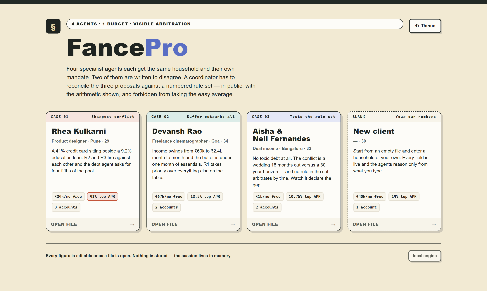
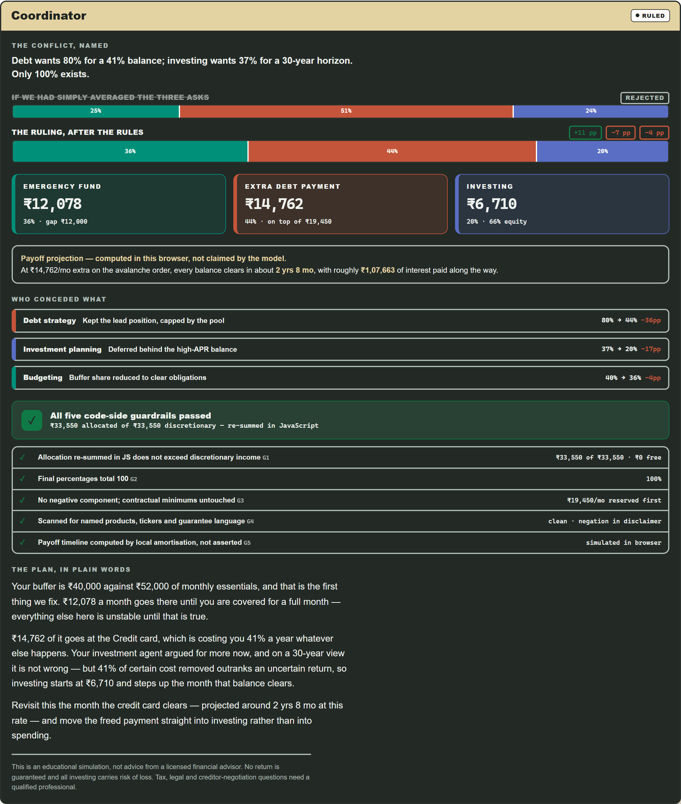
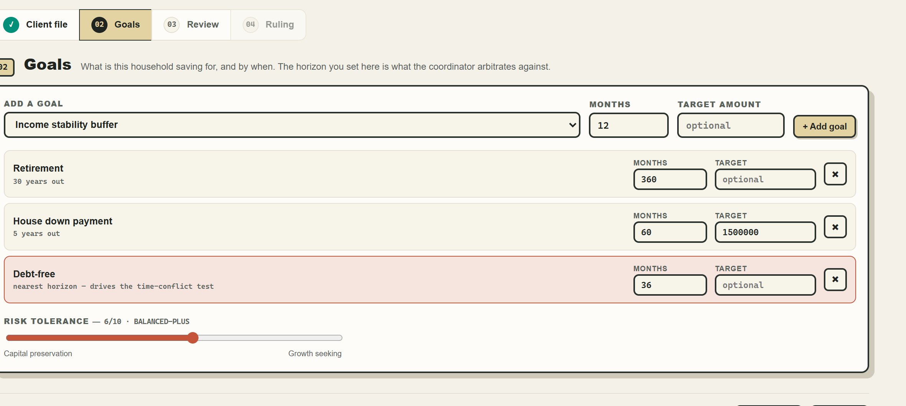
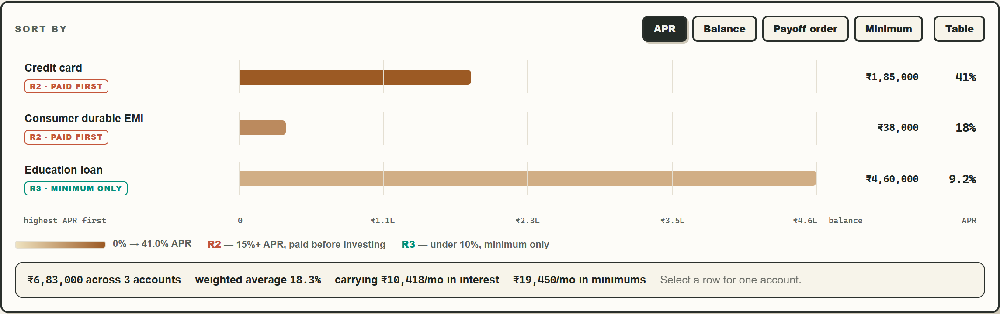
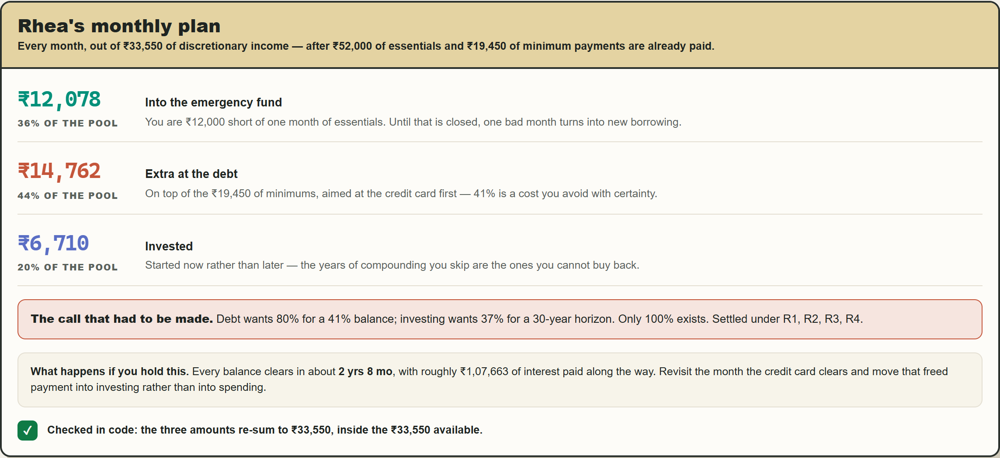
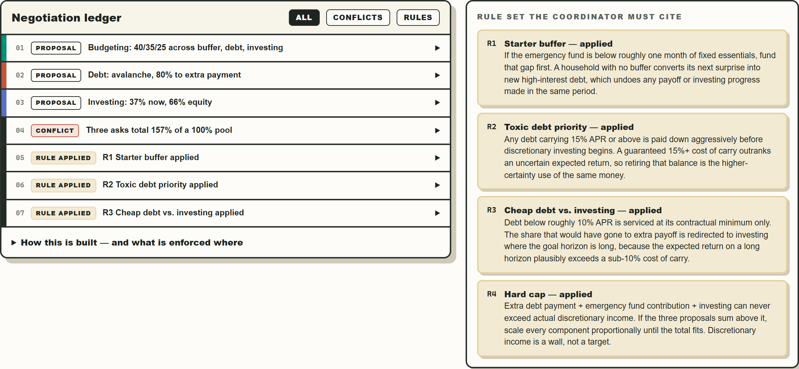
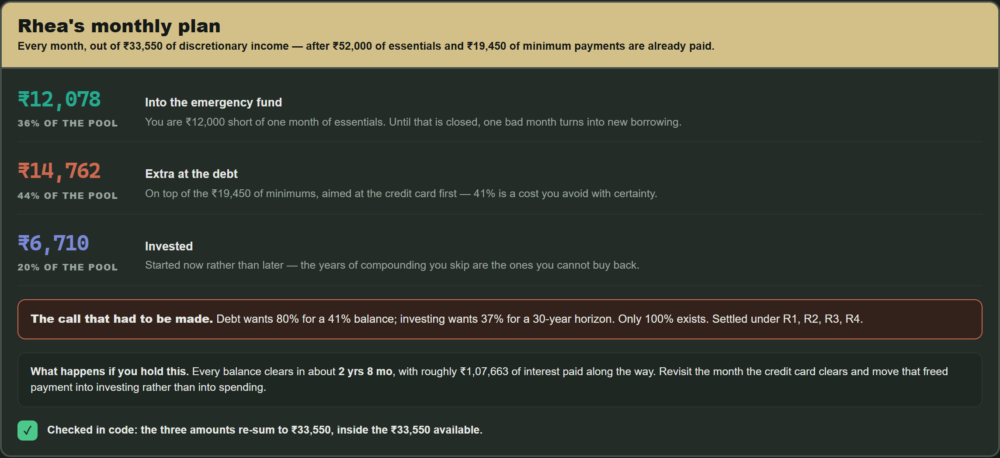

<h1 align="center">FancePro</h1>

<p align="center">
  <strong>A multi-agent financial advisory simulator where four agents argue over one household budget —<br>
  and you can audit exactly how the disagreement was settled.</strong>
</p>

<p align="center">
  <a href="https://atharvalakhe.github.io/AtharvaLakhe/"></a>
  
  
  
  <a href="LICENSE"></a>
</p>

<p align="center">
  <a href="https://atharvalakhe.github.io/AtharvaLakhe/"><b>Open the live demo →</b></a>
</p>

<p align="center">
  
</p>

> Built for the Cognition problem statement *"Multi-Agent Financial Advisory Simulator."*

---

## Contents

[The problem](#the-problem) · [Why multi-agent](#why-multi-agent) · [The agents](#the-agents) · [Guardrails](#guardrails-contract-vs-code) · [The interface](#the-interface) · [Running it](#running-it) · [Verification](#verification) · [Project structure](#project-structure)

---

## The problem

Personal financial planning means balancing goals that genuinely compete — debt payoff, savings, investing. Ask one model to do all of it in one prompt and it quietly picks a favourite, or splits the difference and calls it balance. Neither is a plan you can defend.

The fix isn't a smarter single prompt. It's separating the concerns into specialists that each argue their own corner, and forcing a coordinator to reconcile them **against visible rules** instead of averaging them into mush.

## Why multi-agent

The point is not having four boxes on screen. The point is that the agents are deliberately constrained:

- the budgeting agent can size the pool, but cannot pick debt strategy or investments
- the debt agent is biased toward certainty — interest avoided is concrete
- the investment agent is biased toward time — delayed compounding has a cost
- the coordinator has to resolve the conflict by citing rules and showing arithmetic

That structure makes disagreement **inspectable**. A single all-purpose answer hides its tradeoffs; this interface makes the tradeoff the object being audited.

## The agents

Four deterministic agents, each with its own mandate and a strict JSON contract.

| # | Agent | Mandate | Cannot |
|---|-------|---------|--------|
| 1 | **Budgeting** | Confirms true discretionary income, proposes a three-way split (buffer / debt / investing) | Pick a payoff method or asset mix |
| 2 | **Debt strategy** | Payoff method + share of discretionary income for *extra* payment | Set the investing share |
| 3 | **Investment planning** | Share to start investing now + category-level mix | Name any product; choose a payoff method |
| 4 | **Coordinator** | Sees all three. Names the conflict, cites a numbered rule, publishes one allocation | **Average the proposals** |

Agents 2 and 3 are written to disagree — one argues certainty of interest saved, the other argues time in the market. **That is the point.** The conflict is structural, not staged, because both are asking for the same rupees out of a pool that cannot cover both.

### The coordinator's rule set

| Rule | Trigger | Effect |
|------|---------|--------|
| **R1** Starter buffer | Emergency fund below ~1 month of essentials | Fund that gap first |
| **R2** Toxic debt | Any debt ≥ 15% APR | Paid aggressively before discretionary investing |
| **R3** Cheap debt | Debt below ~10% APR | Minimum only; freed share goes to investing on a long horizon |
| **R4** Hard cap | Asks exceed discretionary income | Scale every component proportionally until it fits |

If none of the four cleanly covers the real conflict, the coordinator **says so** in a `rule_gap` field rather than stretching a citation. Case 03 exercises this: the dispute there is a wedding 18 months out versus a 30-year horizon, and no rule in the set arbitrates by time.

---

## Guardrails: contract vs. code

This distinction is the honest part of the submission, so it is surfaced in the UI rather than buried.

**Enforced in the agent contracts** — no named stocks, funds, schemes, insurers, brokers or tickers; no guaranteed or projected returns; no legal, tax-filing or debt-settlement advice; no figure that isn't in the client file.

**Enforced in code** — these run in JavaScript after the plan is built and render as a pass/fail panel:

| ID | Check |
|----|-------|
| `G1` | Allocation re-summed in JS must not exceed discretionary income |
| `G2` | Final percentages total 100 (±1pp rounding) |
| `G3` | No negative component; contractual minimums stay reserved |
| `G4` | Output regex-scanned for ticker-shaped tokens, named institutions, guarantee language |
| `G5` | Payoff timeline is a **local amortisation simulation**, not an assertion |
| `G6` | JSON parsed defensively — fences stripped, then first `{` to last `}` |

`G4` earns its keep: during development it caught the engine's *own* narrative using the phrase "a guaranteed 41% saved". The check failed the flagship persona and the copy was rewritten.

`G5` matters too — on Case 01 the debt agent asserts a 21-month payoff, while the browser's own simulation of the coordinator's actual allocation returns 32 months. Both numbers are shown, side by side.

<p align="center">
  
</p>

---

## The interface

### A queue, not a wall of fields

You pick a client first, then move through one stage at a time.

```text
Pick a client  →  01 Client file  →  02 Goals  →  03 Review & convene  →  04 The ruling
```

Each stage gates the next and says **why** it is blocked — no discretionary income left to allocate, or no goal with a horizon for the investment agent to argue for. The stepper is clickable for anything already cleared, so going back to change a figure never means starting over.

### Goals are yours to define



Pick from a 23-goal catalogue grouped by kind — safety, debt, home & vehicle, family, growth, work & life — or name a custom one. The catalogue horizon is only a starting suggestion: **months are editable on every goal**, with an optional target amount.

That number matters. The shortest horizon is exactly what the coordinator arbitrates against, so setting a goal inside two years lets you open the rule gap yourself, on any persona. The nearest-horizon goal is highlighted so it's clear which one is driving the logic.

### The debt chart



Balance is the magnitude, so it gets bar length. APR is a second measure on a different scale — which is never a second axis — so it sets the fill from a single-hue sequential ramp and is stated as a direct label. The rule that applies rides alongside as **text** (`R2 · paid first`, `R3 · minimum only`, `judgement call`), never colour alone.

Re-sort by APR, balance, payoff order or minimum and the bars redraw; hover for cost of carry; click for full account detail; toggle to a table view for the same data as figures.

### The ruling is last, and leads in plain words



The final stage opens with the monthly plan as three amounts, each with a one-line reason written from that household's actual figures, the call that had to be made, what happens if they hold it, and the code-side check restated in a sentence. The full working — conflict, rules applied, concessions, guardrail table, negotiation ledger — sits underneath behind one disclosure: complete, but out of the way.



### Four cases ship with it

Each exercises a different path through the rules:

| Case | Client | What it tests |
|------|--------|---------------|
| **01** | Rhea Kulkarni | A 41% credit card beside a 9.2% education loan. R2 and R3 fire against each other; the debt agent asks for 80% of the pool. Sharpest conflict. |
| **02** | Devansh Rao | Irregular freelance income, buffer under one month of essentials. R1 outranks everything. |
| **03** | Aisha & Neil Fernandes | No toxic debt at all. The conflict is time-horizon, not interest-rate, and the coordinator declares the rule gap. |
| **Blank** | — | Enter your own household. |

### Built for both themes



Dark is *selected*, not flipped: its own steps from the same hues, validated against the dark surface. The three allocation colours pass a full palette check in both modes — lightness band, chroma floor, colour-vision-deficiency separation (worst adjacent pair ΔE 8.5), normal-vision separation, and contrast.

Also: visible focus states, full keyboard operation, `aria-live` status announcements, `prefers-reduced-motion` respected, and a print stylesheet.

---

## Running it

**Self-contained. No build, no dependencies, no server, no account, no API key.**

```bash
git clone https://github.com/AtharvaLakhe/AtharvaLakhe.git
cd AtharvaLakhe
start index.html          # Windows  ·  macOS: open index.html  ·  Linux: xdg-open index.html
```

Every agent is played by deterministic code in `index.html`. All four personas produce persona-specific figures computed from the live client file — nothing is stubbed and no network is touched. There is no `.env`, no package install, and no build command.

State lives in memory only: no `localStorage`, no `sessionStorage`. Close the tab and the session is gone.

### Publishing with GitHub Pages

**Settings → Pages → Source: Deploy from a branch → `main` → `/ (root)` → Save.**
Pages serves `index.html` directly at `https://atharvalakhe.github.io/AtharvaLakhe/`.

---

## Verification

The engine is exercised headlessly across all four personas and every render path — proposals, ruling, ledger, chart at each sort in both chart and table view, step gating, plus thinking / error / mixed-agent states — and the rendered page is checked in a real browser for geometry and console errors.

| Property | Result |
|---|---|
| Allocation vs. discretionary income | Sums exactly, all four personas |
| Final percentages | Total 100 |
| Trace length | 5–7 entries |
| Narrative length | 103–129 words |
| Bar geometry | Within 0–100% of track; largest always full scale |
| Axis alignment | Interior tick labels within 1px of their gridline |
| CSS tokens | All 47 `var()` references resolve; light/dark blocks symmetric |
| DOM references | All 43 `getElementById` targets exist |
| Console | No page errors in either theme |

## Sample output

[`examples/sample-plan.md`](examples/sample-plan.md) is a real export from Case 01 — the file the app writes when you click **Download plan**, unedited apart from the run date.

## Project structure

```text
.
├── index.html              # the entire application — markup, styles, agents, engine
├── assets/                 # screenshots used in this README
├── examples/
│   └── sample-plan.md      # a real exported plan
├── README.md
├── LICENSE                 # MIT
├── .gitattributes
└── .gitignore
```

---

## Disclaimer

An educational simulation, not advice from a licensed financial advisor. No return is guaranteed and all investing carries risk of loss. Tax, legal, and creditor-negotiation questions need a qualified professional.

## License

[MIT](LICENSE) © Atharva Lakhe
