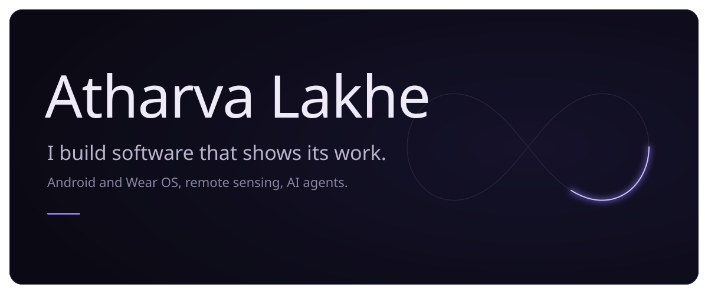
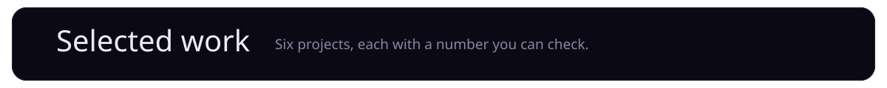
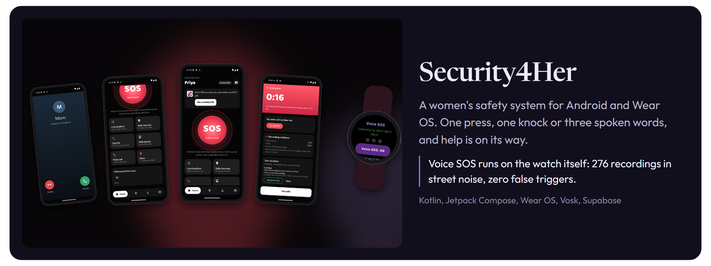
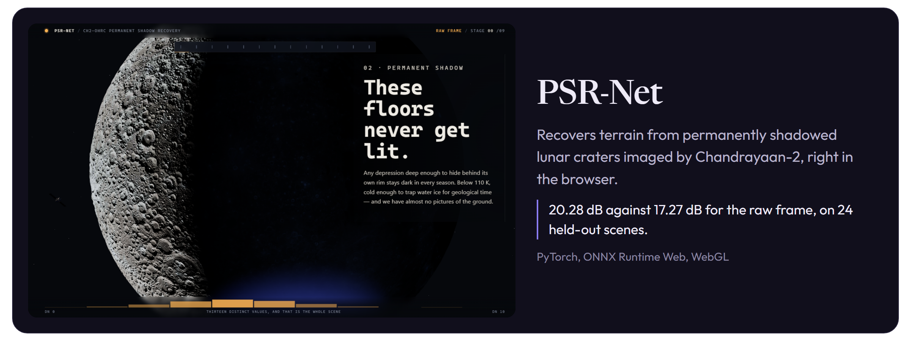
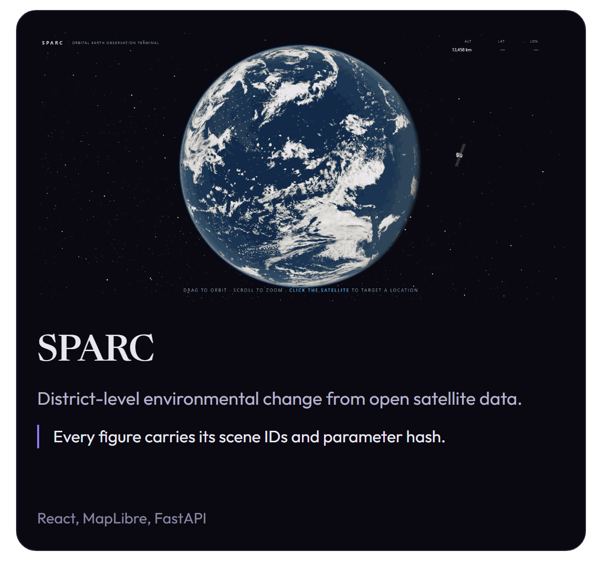
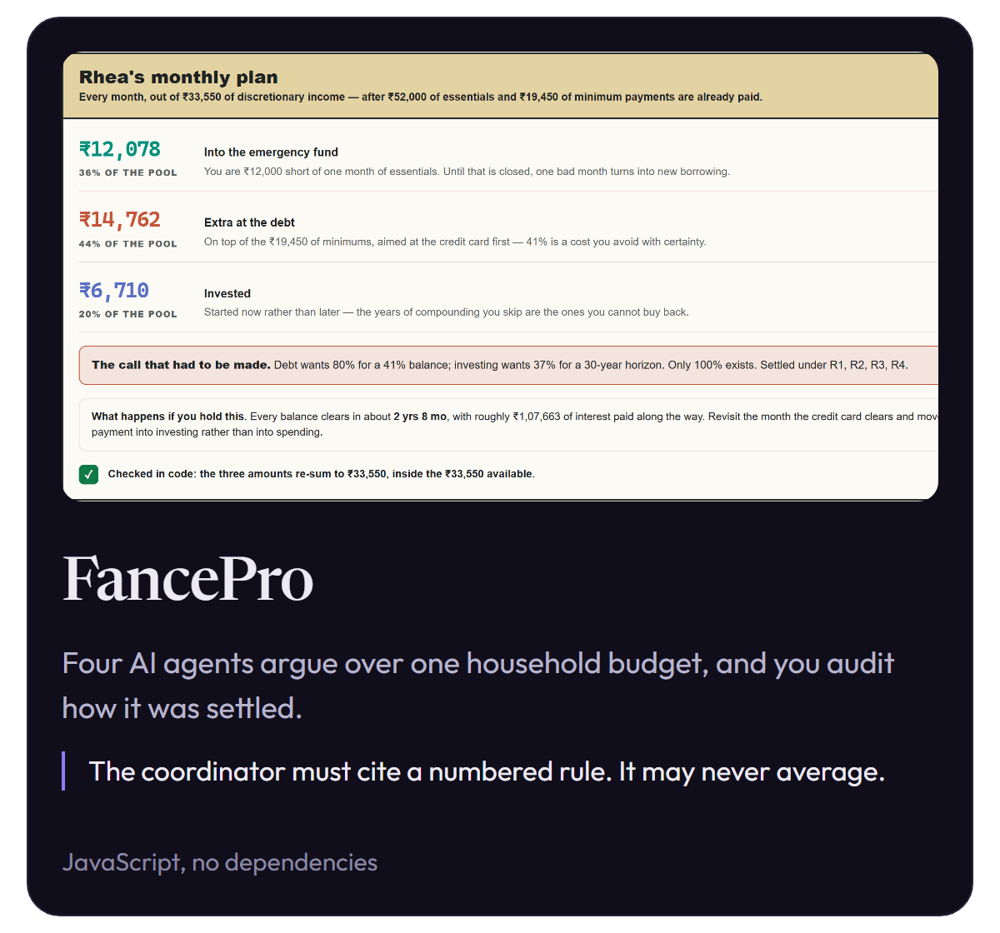
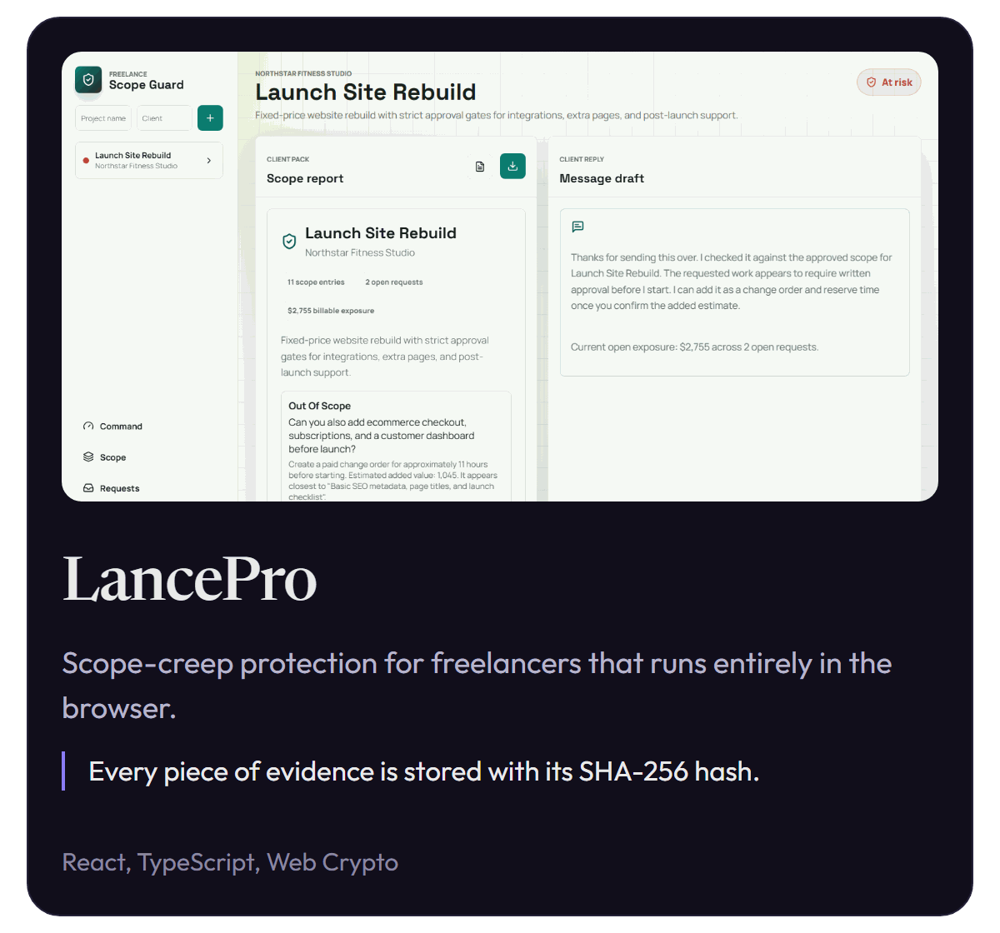

 

A number you cannot trace is not a result. Every repository here ships the numbers behind its claims, including
the ones that didn't go my way.

I work in **Kotlin** and **Jetpack Compose** for Android and Wear OS, **Python**, **PyTorch** and **ONNX** for
imagery, and **TypeScript** and **React** for the web.

Say hello at [atharvalakhe09@gmail.com](mailto:atharvalakhe09@gmail.com).
