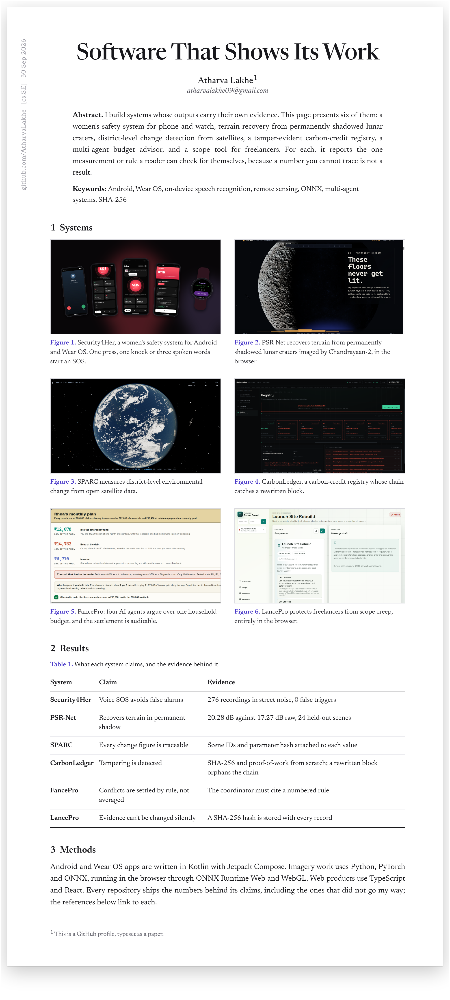

### References

1. **Security4Her.** A women's safety system for Android and Wear OS. [security4her.vercel.app](https://security4her.vercel.app)
2. **PSR-Net.** Terrain recovery from permanently shadowed lunar craters. [github.com/AtharvaLakhe/PSR-Net](https://github.com/AtharvaLakhe/PSR-Net)
3. **SPARC.** District-level environmental change from open satellite data. [github.com/AtharvaLakhe/SPARC](https://github.com/AtharvaLakhe/SPARC)
4. **CarbonLedger.** A tamper-evident carbon-credit registry. [github.com/AtharvaLakhe/CarbonLedger](https://github.com/AtharvaLakhe/CarbonLedger)
5. **FancePro.** Four AI agents, one household budget, an auditable settlement. [github.com/AtharvaLakhe/FancePro](https://github.com/AtharvaLakhe/FancePro)
6. **LancePro.** Scope-creep protection for freelancers. [github.com/AtharvaLakhe/LancePro](https://github.com/AtharvaLakhe/LancePro)

Correspondence: [atharvalakhe09@gmail.com](mailto:atharvalakhe09@gmail.com)
