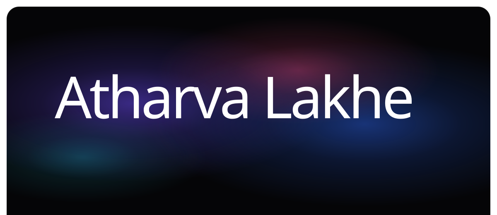
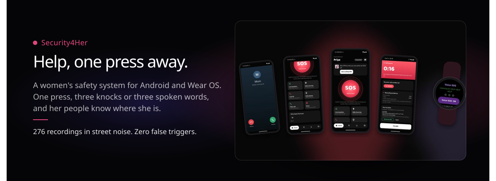
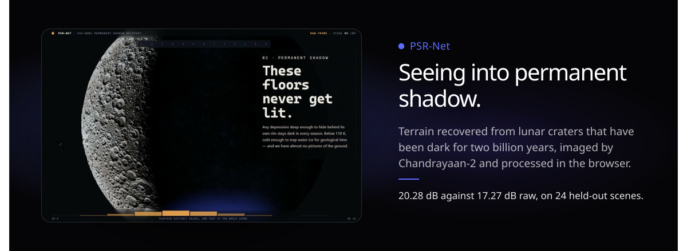
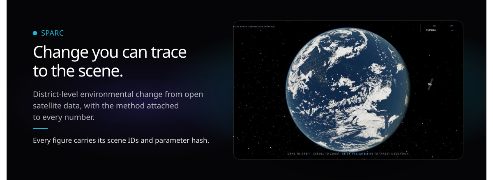
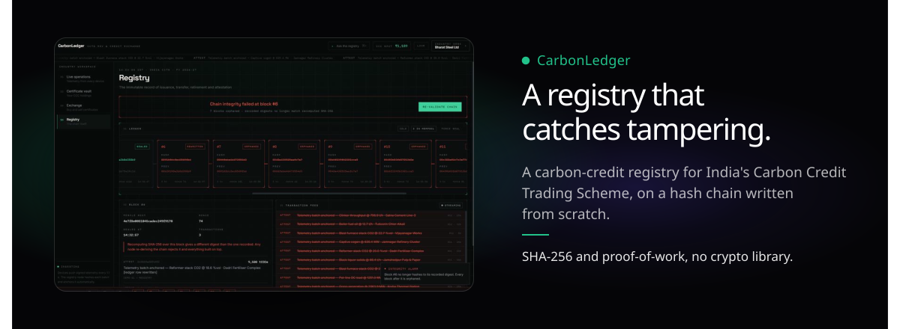
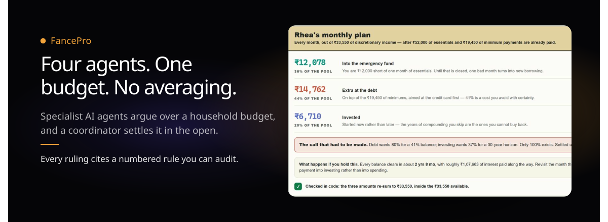
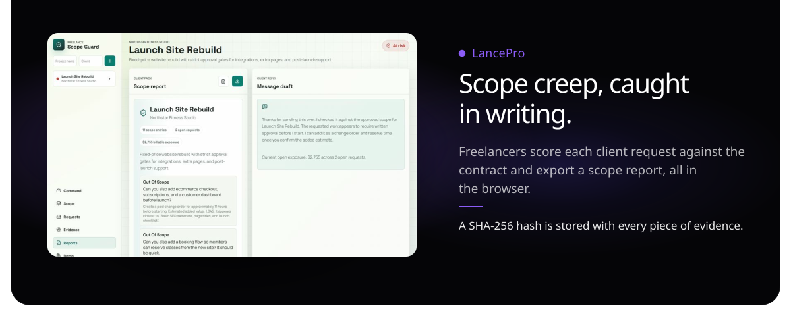

 

<a href="https://security4her.vercel.app">Security4Her</a> ·
<a href="https://github.com/AtharvaLakhe/PSR-Net">PSR-Net</a> ·
<a href="https://github.com/AtharvaLakhe/SPARC">SPARC</a> ·
<a href="https://github.com/AtharvaLakhe/CarbonLedger">CarbonLedger</a> ·
<a href="https://github.com/AtharvaLakhe/FancePro">FancePro</a> ·
<a href="https://github.com/AtharvaLakhe/LancePro">LancePro</a> ·
<a href="mailto:atharvalakhe09@gmail.com">Email</a>

