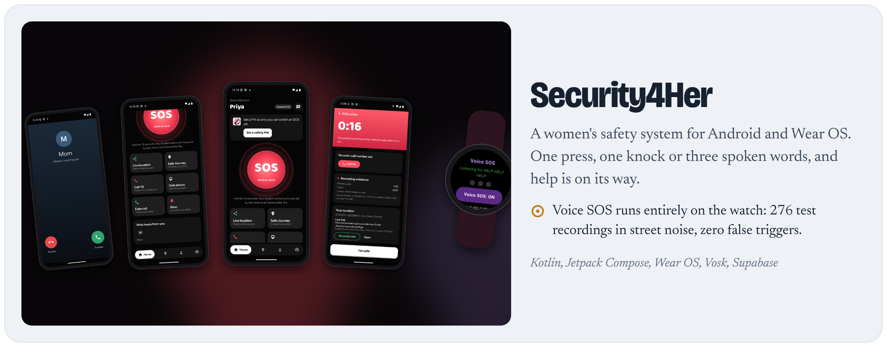
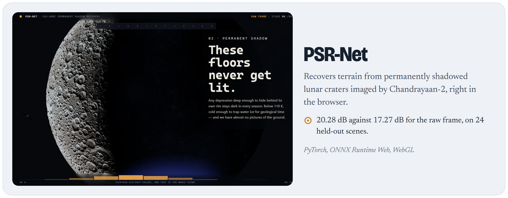
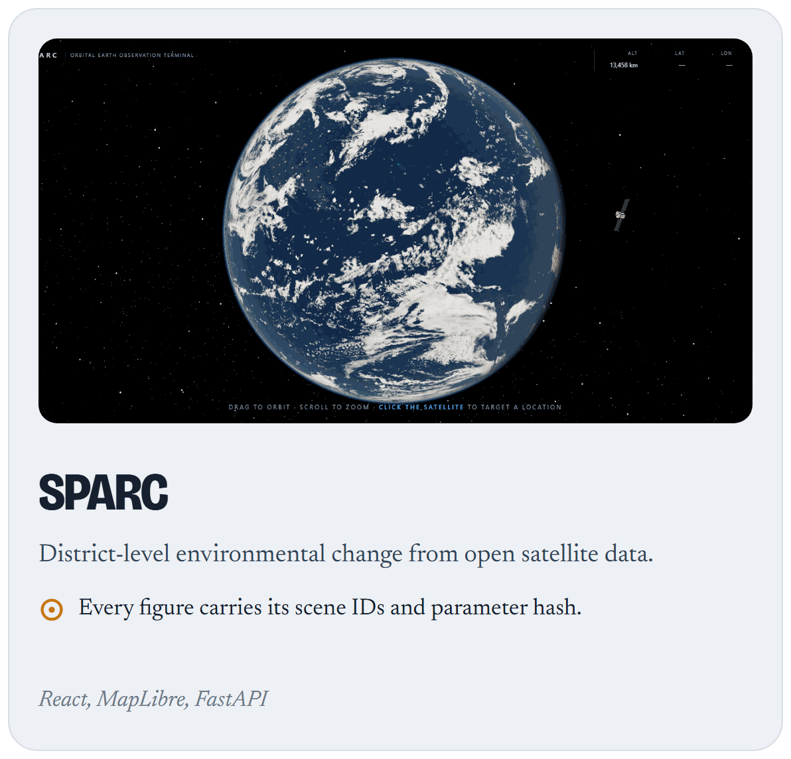
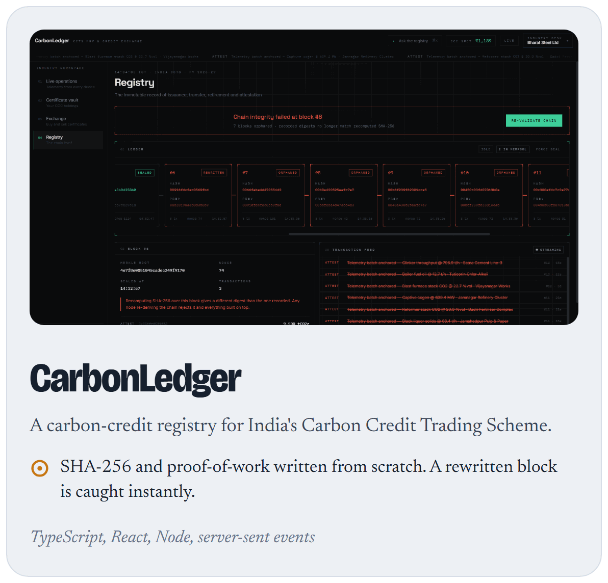
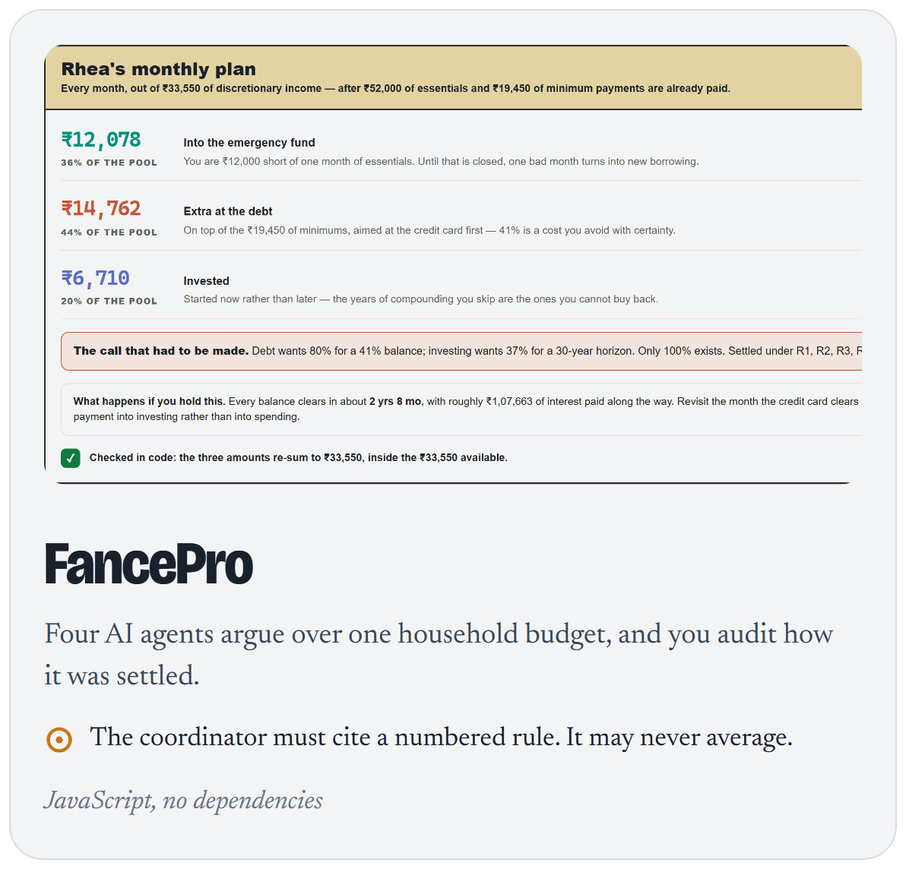
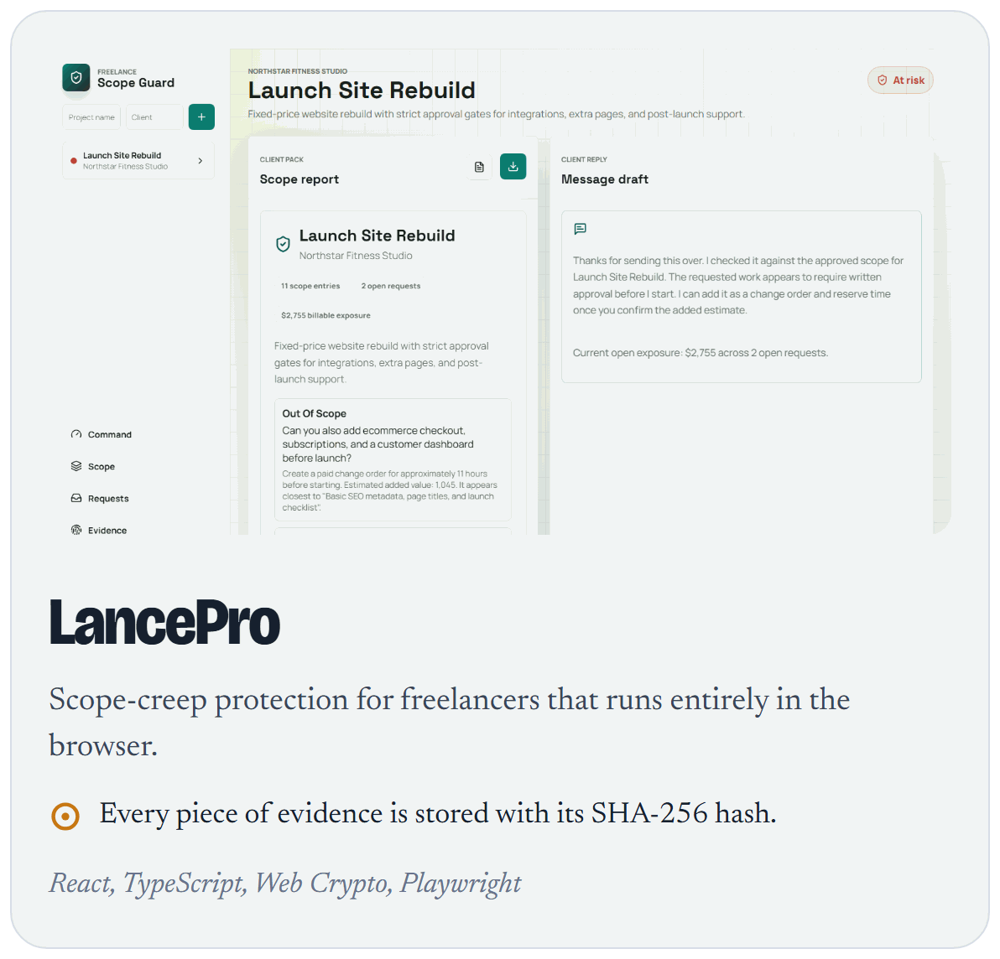

<picture>
  <source media="(prefers-color-scheme: dark)" srcset="assets/hero-dark.svg">
  
</picture>

  

<a href="https://security4her.vercel.app"><picture>
  <source media="(prefers-color-scheme: dark)" srcset="assets/plates/security4her-dark.png">
  
</picture></a>

<a href="https://github.com/AtharvaLakhe/PSR-Net"><picture>
  <source media="(prefers-color-scheme: dark)" srcset="assets/plates/psr-net-dark.png">
  
</picture></a>

<a href="https://github.com/AtharvaLakhe/SPARC"><picture>
  <source media="(prefers-color-scheme: dark)" srcset="assets/plates/sparc-dark.png">
  
</picture></a>
<a href="https://github.com/AtharvaLakhe/CarbonLedger"><picture>
  <source media="(prefers-color-scheme: dark)" srcset="assets/plates/carbonledger-dark.png">
  
</picture></a>

<a href="https://github.com/AtharvaLakhe/FancePro"><picture>
  <source media="(prefers-color-scheme: dark)" srcset="assets/plates/fancepro-dark.png">
  
</picture></a>
<a href="https://github.com/AtharvaLakhe/LancePro"><picture>
  <source media="(prefers-color-scheme: dark)" srcset="assets/plates/lancepro-dark.png">
  
</picture></a>

 

Every repository here ships the numbers behind its claims, including the ones that didn't go my way. The amber
mark on each project is the one you can check yourself.

I work in **Kotlin** and **Jetpack Compose** for Android and Wear OS, **Python**, **PyTorch** and **ONNX** for
imagery, and **TypeScript** and **React** for the web.

Say hello at [atharvalakhe09@gmail.com](mailto:atharvalakhe09@gmail.com).
