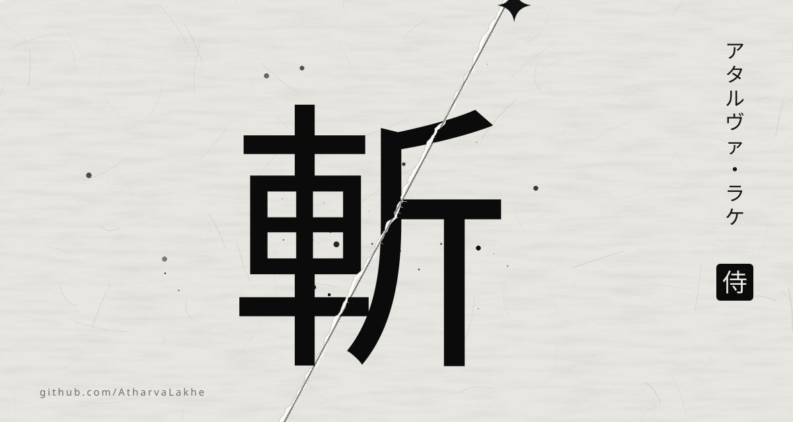

  <a href="https://atharvalakhe.github.io/AtharvaLakhe/"><picture>
    <source media="(max-width: 700px)" srcset="katana/banner-mobile.svg">
    
  </picture></a>

  
  
  
  
  
  
  
  
  
  
  
  

  

  
  

  

  <a href="https://security4her.vercel.app">Security4Her</a>&nbsp;&nbsp;&nbsp;
  <a href="https://github.com/AtharvaLakhe/PSR-Net">PSR-Net</a>&nbsp;&nbsp;&nbsp;
  <a href="https://github.com/AtharvaLakhe/SPARC">SPARC</a>&nbsp;&nbsp;&nbsp;
  <a href="https://github.com/AtharvaLakhe/CarbonLedger">CarbonLedger</a>&nbsp;&nbsp;&nbsp;
  <a href="https://github.com/AtharvaLakhe/FancePro">FancePro</a>&nbsp;&nbsp;&nbsp;
  <a href="https://github.com/AtharvaLakhe/LancePro">LancePro</a>&nbsp;&nbsp;&nbsp;
  <a href="mailto:atharvalakhe09@gmail.com">Email</a>

